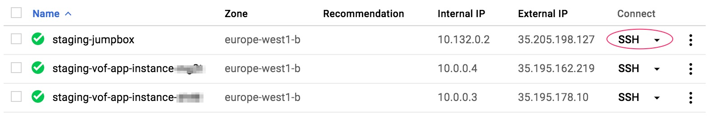

# SSH Access

## Using `gcloud` in the terminal
1. [Install gcloud](https://cloud.google.com/sdk/downloads) on your local machine.
2. Run `gcloud init`. This will guide you through setting up a GCP project (i.e. vof-tracker) on your local machine.
3. Run `gcloud compute instances list`. This shows the instances running on the project you setup above. Please note that only those machines named <environment>-jumpbox allow direct SSH access from your machine. It is through them that you can access the internal network virtual machines.
4. Run `gcloud compute ssh <firstname>_<lastname>@<machine-name> --zone europe-west1-b`. Swap <machine-name> with the jump box whose environment you want to access via SSH. This will log you into the jumpbox and it is from here that you can access the virtual machines running the VOF app. <firstname>_<lastname> refers to the names in your Andela email.
5. Run `gcloud compute instances list` again to see the available virtual machines.
6. Run `gcloud compute ssh <firstname>_<lastname>@<machine-name>` --zone europe-west1-b` but this time use one of the other virtual machines list by the above command. Note that the jumping box can only access the machines whose environment name it also bears.
7. If it is the first time the your account is accessing the server, SSH keys will be generated and a passphrase requested. Just press enter when prompted for the passphrase.

#### Accessing the VOF application
8. Once logged in, the prompt will display your name however, to do anything with the VOF application you need to login as the a user called `vof`.
9. Run `sudo su vof` to change the account to the `vof` user.
10. Run `cd ~` to go to the home directory of the vof user.
11. Run `cd app`. This is the folder that contains the VOF application and where normal rails, rake and ruby commands affecting the application can be run.

## Using Google Console
1. Log into Google Console
2. Select the appropriate project you want to view in the console i.e. vof-tracker.
3. Click `Compute Engine` link from the menu.
4. Click the SSH button on the jumpbox machine and a SSH session will start in a separate tab. The SSH button is encircled in red below.
5. When the session is ready follow instructions 5 - 11 above.

 

**NOTE: Only people that have IAM roles setup on the particular GCP VOF project can gain SSH access to any of the VMs including the jumpbox**